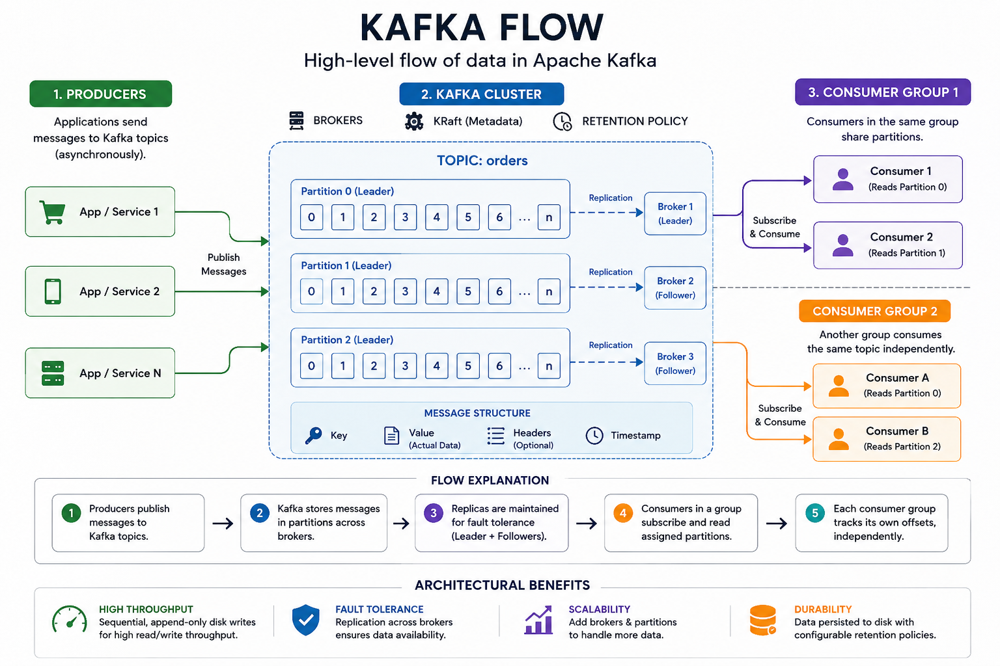

<p align="center">
  
</p>


# Kafka

---

## Definition

An open-source, distributed event streaming platform designed for high-throughput, real-time data pipelines for big data.

- **Scalable**     : TBs of data & millions of events/sec.
- **Reliable**     : Fault tolerance through replication.
- **Durable**      : Persistent storage with configurable retention.
- **Distributed**  : Multiple brokers for scalability.

### Traditional Architecture

- Tightly coupled, synchronous communication.
- Producers wait for consumers to complete consumption.
- Adding new consumers often requires producer changes.

### Kafka Architecture

- Loosely coupled, asynchronous system.
- Producers publish messages to topics.
- Multiple consumer groups independently consume the same data.
- New consumers can be added without modifying producers.

---

## Kafka Architecture

```text
                           Producer
                               │
                               ▼
        Kafka Cluster (Brokers • KRaft • Retention Policy)
                               │
                               ▼
     Topic (Partitions • Replication Factor • Message Structure)
                               │
                               ▼
      Consumer Group (consumer-1, consumer-2, consumer-n)

Policy

Kafka             : ACL (create, alter, describe, write, read, delete)
Azure Event Hubs  : Send, Listen, Manage
```

---

## Kafka Cluster

A collection of brokers that work together to provide scalability, HA, and fault tolerance.

### 1. Broker

A Kafka server that stores topic partitions and serves producer/consumer requests.

### 2. KRaft

Kafka's metadata management mode that manages cluster metadata (brokers, topics, partitions, leaders, replicas) and performs leader elections.

### 3. Retention Policy

Defines how long or how much data Kafka retains before deletion.

- **Time-based** : `log.retention.hours`
- **Size-based** : `log.retention.bytes`

---

## Topic

A logical stream of messages (similar to a table in a database).

### 1. Partition

- Divides a topic into multiple partitions for parallel processing and scalability.
- Messages are assigned using a message key (hashing) or the producer's partitioning strategy (ex: sticky/round-robin).
- Ordering is guaranteed only within a partition.

### 2. Replication Factor

- Number of copies of each partition stored across different brokers for fault tolerance and high availability (HA).
- Each partition has one leader and one or more follower replicas.
- On leader failure, KRaft automatically elects an in-sync follower as the new leader.

### 3. Message Structure

- Key
- Value (actual data)
- Headers (optional metadata)
- Timestamp

---

## Producers

- Publish messages to one or more topics using an asynchronous (fire-and-forget) model.
- Route messages to partitions using a key or the producer's partitioning strategy.

Support:

- **Batching** : Groups multiple messages into a single network request to improve throughput and reduce network overhead.
- **Compression** : Compresses messages before sending to reduce network bandwidth and storage usage.
- **Retries** : Automatically retries sending messages in case of transient failures.
- **Acknowledgments** : Confirms successful message delivery from Kafka brokers, ensuring reliable delivery.

---

## Consumer Groups

- A logical group of consumers that work together to consume a topic.
- Within a consumer group, each partition is assigned to only one consumer at a time, while a consumer can read one or more partitions.
- Each consumer group maintains its own partition offsets/partitions, allowing multiple CG's to independently consume & replay the same topic (subject to retention policy).

---

## Consumers

Subscribe to one or more topics and read messages from the assigned partition(s), tracking their progress using offsets.

---

## Architectural Benefits

1. **High throughput** : Sequential append-only disk writes enable high read/write throughput.
2. **Fault tolerance** : Replication Factor across brokers.
3. **Scalability** : Add brokers & partitions.
4. **Durability** : Persisted to disk with configurable retention policies.