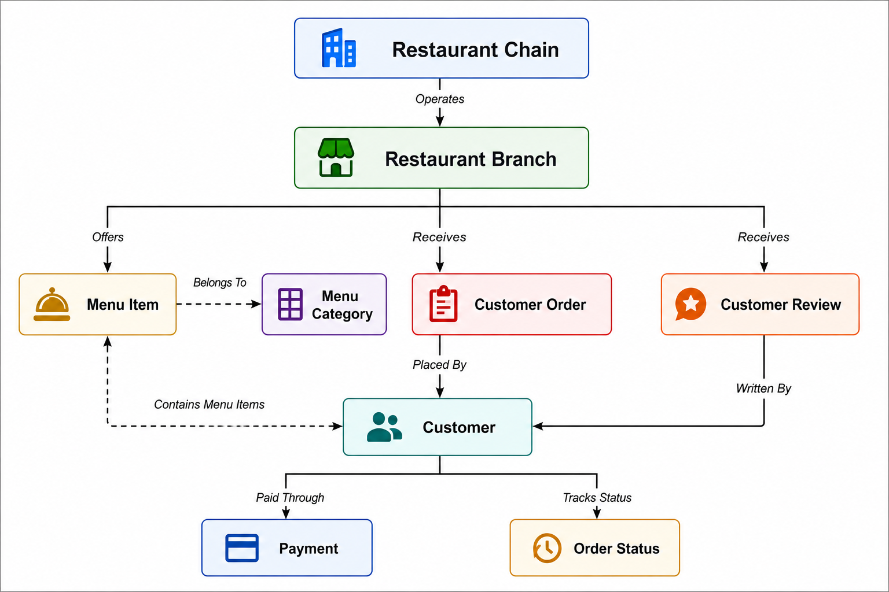
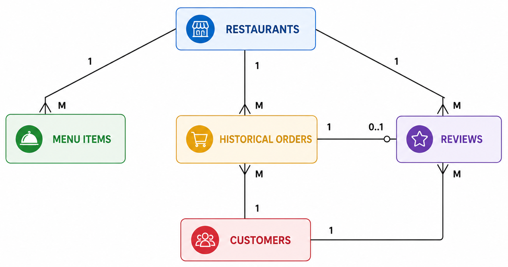
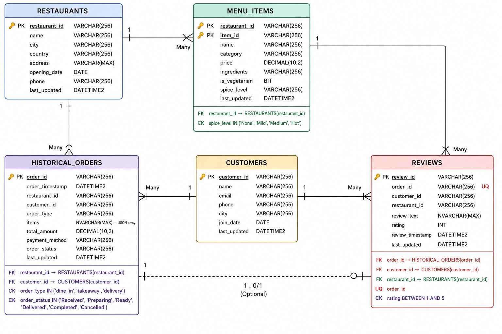
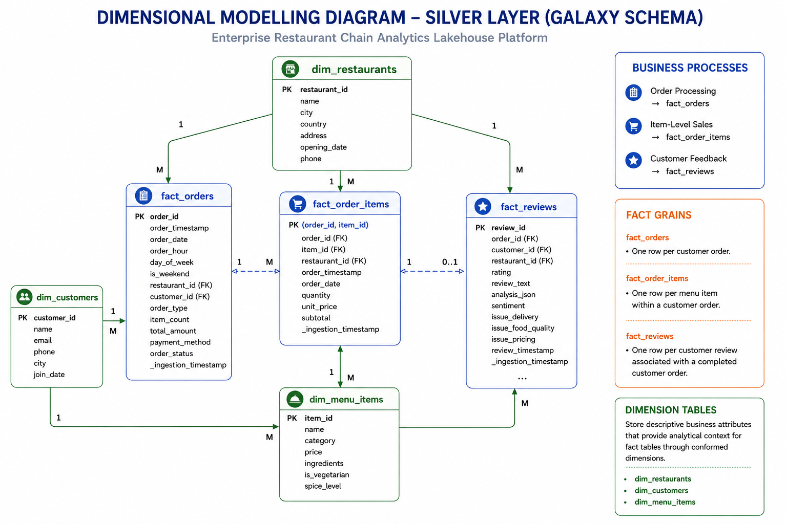
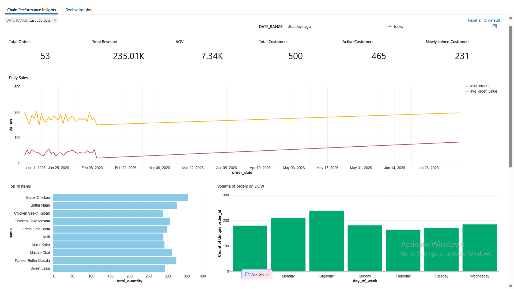
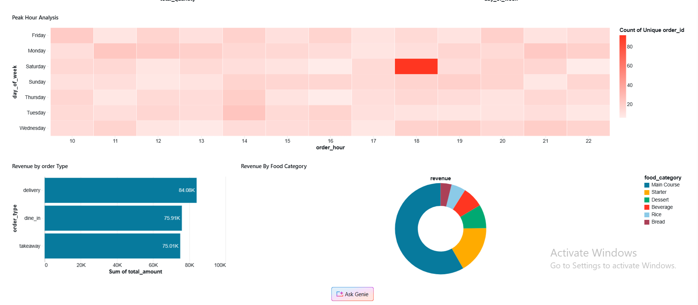
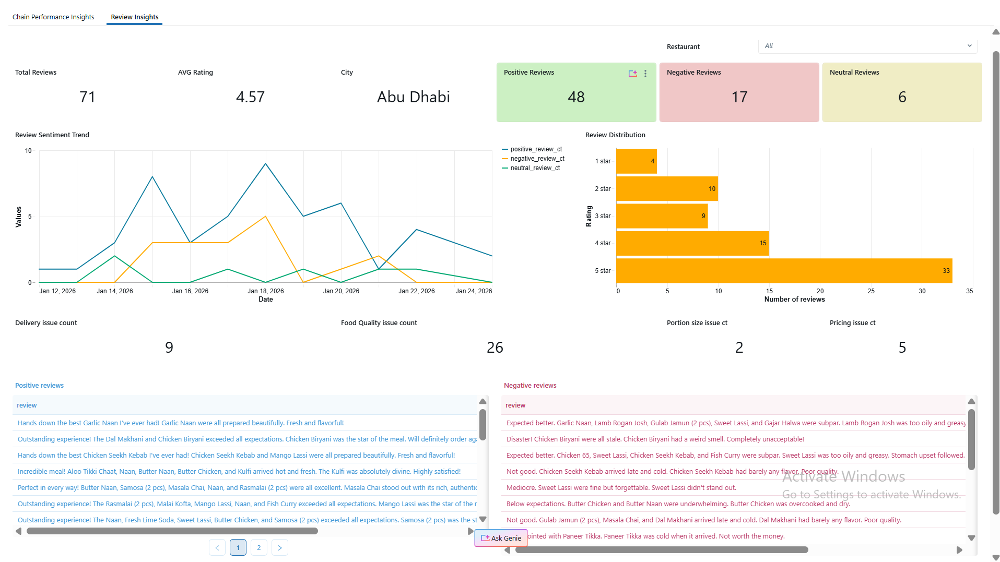
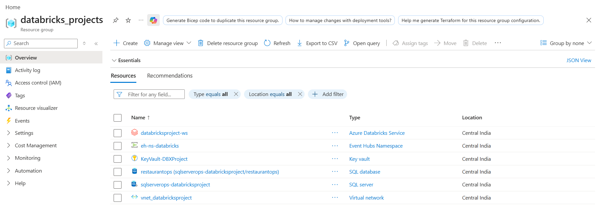

# Enterprise Restaurant Chain Analytics Lakehouse Platform

> **An end-to-end Azure Databricks Lakehouse solution demonstrating batch + real-time data ingestion, Medallion Architecture, Kimball Dimensional Modeling, Lakeflow Connect, Spark Declarative Pipelines, Unity Catalog governance, Databricks Asset Bundles, and AI/BI dashboards.**

---

# Architecture

<p align="center">
  
</p>

## Overview

This project simulates how a modern restaurant chain can build an enterprise analytics platform by combining historical transactional data from Azure SQL Database with real-time order events from Azure Event Hubs.

The solution follows the **Medallion Architecture (Bronze → Silver → Gold)** and uses **Azure Databricks** as the unified platform for ingestion, transformation, governance, orchestration, and analytics.

## Key Features

- Azure Databricks Lakehouse
- Azure SQL Database + Change Data Capture (CDC)
- Azure Event Hubs real-time streaming
- Lakeflow Connect
- Spark Declarative Pipelines (SDP)
- Delta Lake
- Unity Catalog
- SCD Type 2 Dimensions
- Kimball Galaxy Schema
- Databricks Asset Bundles (DAB)
- Serverless Compute
- AI/BI Dashboards
- Mosaic AI Sentiment Analysis

---

# Technology Stack

| Category | Technology |
|-----------|------------|
| Cloud | Microsoft Azure |
| Compute | Azure Databricks Serverless |
| Storage | ADLS Gen2 + Delta Lake |
| Database | Azure SQL Database |
| Streaming | Azure Event Hubs |
| ETL | Lakeflow Connect, Spark Declarative Pipelines |
| Language | PySpark, SQL |
| Governance | Unity Catalog |
| Deployment | Databricks Asset Bundles |
| CI/CD | GitHub |

---

# Business Process Model

<p align="center">

</p>

Illustrates how restaurant branches, customers, menu items, orders, reviews and payments interact before translating them into data models.

---

# Conceptual Data Model

<p align="center">

</p>

Defines the core business entities and relationships independent of implementation.

---

# ER Data Model (OLTP)

<p align="center">

</p>

Normalized Azure SQL schema designed in 3NF with PK, FK, constraints and referential integrity.

---

# Dimensional Model (Silver Layer)

<p align="center">

</p>

Implements a Kimball **Galaxy Schema**.

### Fact Tables
- fact_orders
- fact_order_items
- fact_reviews

### Dimensions
- dim_restaurants
- dim_customers
- dim_menu_items

---

# End-to-End Data Flow

```text
Azure SQL Database
        │
Lakeflow Connect (CDC)
        │
Azure Event Hubs ──► Spark Declarative Pipelines
        │
      Bronze
        │
      Silver
        │
       Gold
        │
AI/BI Dashboards + Genie
```

---

# Medallion Architecture

## Bronze
- Raw ingestion
- CDC
- Streaming
- Auditability

## Silver
- Cleansing
- Standardization
- SCD Type 2
- Data Quality
- Fact & Dimension modeling

## Gold
- Materialized Views
- Business KPIs
- Customer 360
- Review Analytics

---

# Dashboards

## Chain Performance

<p align="center">

</p>

<p align="center">

</p>

Business KPIs including revenue, orders, AOV, customer metrics, top-selling items and weekday trends.

---

## Review Insights

<p align="center">

</p>

Uses Mosaic AI sentiment analysis to classify reviews, identify recurring issues and monitor restaurant quality.

---

# Azure Infrastructure

<p align="center">

</p>

Resources include Azure Databricks, Azure SQL, Event Hubs, Key Vault and Virtual Network.

---

# Repository Structure

```text
Enterprise-Restaurant-Chain-Analytics-Platform
├── 00_synthetic_data
├── 01_pipelines
├── DeclarativeAutomationBundles
├── diagrams
├── Documents
└── README.md
```

---

# Deployment

- Databricks Asset Bundles
- Environment-specific configs (Dev/Prod)
- Lakeflow Jobs
- Unity Catalog
- Secret Scopes
- GitHub version control

---

# Future Enhancements

- Demand Forecasting
- MLflow Integration
- dbt Transformations
- Data Quality Framework
- Feature Store
- RAG Chatbot
- Cost Optimization

---

# Author

**Rahul Talari**

Enterprise Data Engineering Portfolio Project demonstrating production-style Azure Databricks architecture, modern Lakehouse engineering practices and analytics engineering.
